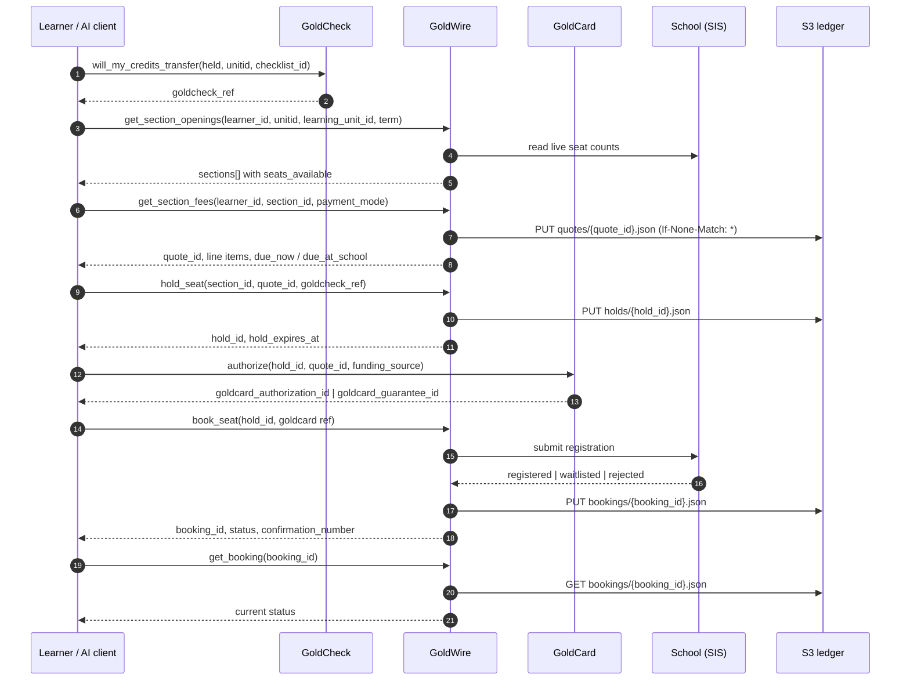

# GoldWire — section openings, fees and seat booking (DRAFT)

> **Status: draft for discussion.** Nothing on this page is live. It proposes the service contract
> for moving a learner from "will this count?" to "I have a confirmed seat", and it is written so the
> arguments and responses can be argued over before any code exists.

**What it would answer:** for a course a learner is seeking, which **sections** have seats, what a seat
**costs**, and — when the learner chooses — **hold, book and confirm** a seat, with a receipt for every
step written to S3.

Contract tag on every answer: `goldwire_v1`.

**Specification:** every call, field and error message is written out in
[goldwire/](goldwire/README.md) — a summary page and one page per call. Where this page differs from it, the spec is right.
[goldwire-openapi.yaml](goldwire-openapi.yaml) is an early machine form, to be regenerated from the spec.

---

## 1. Where GoldWire sits in the flow

Four services, each doing one job. No service does another's job.

| Step | Service | Its one job | What it hands on |
|---|---|---|---|
| 1 | **GoldCheck** | Is this course right for this learner, and what does the school's published record say it counts toward? | `goldcheck_ref` |
| 2 | **GoldWire** | What sections exist, how many seats, what they cost; hold a seat. | `quote_id`, `hold_id` |
| 3 | **GoldCard** | How the seat is paid for: reserve now / pay the school later, or prepay from a funding source. | `goldcard_authorization_id` or `goldcard_guarantee_id` |
| 4 | **GoldWire** | Submit the booking to the school, and report the school's answer. | `booking_id`, `confirmation_number` |
| — | **S3** | The durable record: every quote, hold, payment reference and confirmation is PUT once and read back by GET. | object keys + ETags |



**The school decides.** As everywhere in GoldSeam, the judgment belongs to the institution. A seat
GoldWire *holds* is not a *registration* until the school's own system says so; `CONFIRMED` is only
ever set from the school's answer, never assumed.

---

## 2. The two ways to pay for a seat

| | **Reserve** (the OpenTable model) | **Prepay** (the GoldCard model) |
|---|---|---|
| `payment_mode` | `reserve` | `prepay` |
| What happens at booking | The seat is booked; nothing is charged. GoldCard records a **guarantee** (a card or account on file) against a no-show / late-drop fee, if the school publishes one. | GoldCard **authorizes** the amount due now from the learner's chosen funding source. |
| Who collects tuition | The school, on its own bill, by its own due date. | GoldCard, on the school's behalf, settled to the school. |
| Funding sources | any (only used for the guarantee) | `bank_ach`, `credit_card`, `loan`, `plan_529` |
| Risk it carries | Seat held by someone who may not pay — the school's published drop-for-non-payment rule applies. | Settlement timing — see below. |

**Funding sources do not settle alike**, and the booking must not pretend they do:

- `credit_card` — authorized immediately; captured when the school confirms.
- `bank_ach` — authorized immediately; settles in days; the booking can confirm before settlement.
- `plan_529` — a withdrawal request to the plan, which usually pays the school directly and can take days to weeks. The booking can go to `SUBMITTED` with `funds_status: committed`; the school decides whether to register before the funds arrive.
- `loan` — a private loan disbursement, or a reference to aid the school itself will disburse. Federal aid is packaged and disbursed by the school's financial aid office, not by GoldCard; GoldCard can only record that the learner is relying on it.

---

## 3. The GoldWire services

Money is always `{ "amount": "241.00", "currency": "USD" }`: a decimal string with two places, never a
float, so a price never drifts by a cent in transit.

Reads are **GET**s and never change anything. Anything that changes state is a **PUT** carrying an
`idempotency_key`: sending the same request twice returns the first answer and never takes a second
seat or a second charge.

Common to every request:

| Argument | Type | Notes |
|---|---|---|
| `learner_id` | string | A **pseudonymous** GoldSeam learner token (`lrn_…`), never a name, SSN or school ID. The school's own student ID is exchanged only between GoldWire and the school at booking time. |
| `request_id` | string (uuid) | Correlation id; echoed back on the response and written into every S3 object for the request. |

Common to every response:

| Field | Notes |
|---|---|
| `contract` | `"goldwire_v1"` |
| `request_id` | echoed |
| `as_of` | when the numbers were read from the school, ISO-8601 |
| `source` | where the numbers came from: the school's SIS feed, its published schedule, or its published fee policy — with edition/date |
| `status` | `ok`, `not_held` (we have no schedule or fee record for this), or `offline` (the school's system was unreachable) |

### 3.1 `get_section_openings` — GET

*Which sections of this course have seats this term?*

`GET /goldwire/v1/sections?unitid=…&learning_unit_id=…&term=…`

**Arguments**

| Argument | Required | Type | Notes |
|---|---|---|---|
| `learner_id` | yes | string | |
| `unitid` | yes | string | IPEDS UNITID of the school, from CourseShelf |
| `learning_unit_id` | yes | string | the course, from CourseShelf `learning_units` / `get_learning_unit` |
| `term` | yes | string | the school's term code, e.g. `2027SP` |
| `goldcheck_ref` | no | string | if present, sections are annotated with what GoldCheck said the course counts toward |
| `modality` | no | enum | `in_person`, `online`, `hybrid`, `any` (default) |
| `campus` | no | string | |
| `days` / `time_window` | no | string | e.g. `MWF`, `17:00-22:00` |
| `include_full` | no | bool | default `false`; `true` returns full sections with their waitlist position |

**Response**

```json
{
  "contract": "goldwire_v1",
  "request_id": "7c1e0b52-3d4f-4a8e-9b21-6f0c2d8e1a47",
  "status": "ok",
  "as_of": "2026-09-25T14:02:11Z",
  "source": {
    "kind": "school_sis_feed",
    "unitid": "225070",
    "feed": "banner-ssb",
    "read_at": "2026-09-25T14:02:09Z"
  },
  "learning_unit": {
    "learning_unit_id": "lu_225070_ENGL1301",
    "code": "ENGL 1301",
    "title": "Composition I",
    "credits": 3
  },
  "term": "2027SP",
  "sections": [
    {
      "section_id": "sec_225070_2027SP_ENGL1301_002",
      "section_number": "002",
      "crn": "21457",
      "modality": "in_person",
      "campus": "Main",
      "meetings": [
        {
          "days": "TR",
          "start": "09:30",
          "end": "10:50",
          "room": "LA 114"
        }
      ],
      "instructor": "Staff",
      "starts_on": "2027-01-19",
      "ends_on": "2027-05-14",
      "seats": {
        "capacity": 25,
        "enrolled": 21,
        "held": 2,
        "available": 2,
        "waitlist": {
          "open": true,
          "length": 0,
          "capacity": 5
        }
      },
      "booking": {
        "bookable": true,
        "requires": [
          "prerequisite_check"
        ],
        "hold_window_minutes": 20
      },
      "add_deadline": "2027-01-26",
      "drop_deadline_full_refund": "2027-02-02"
    }
  ],
  "not_held": []
}
```

Seat arithmetic is always shown, never only the result:
`available = capacity − enrolled − held` (holds are GoldWire's own un-expired holds). An airline
oversells; GoldWire does not — `available` never goes below zero, and a section at zero is only
offered with its waitlist.

### 3.2 `get_section_fees` — GET (writes a quote)

*What will this seat cost, and what is due now versus later?*

`GET /goldwire/v1/sections/{section_id}/fees?payment_mode=…`

This is a read of the school's fee record, but it returns a **`quote_id`** so the price the learner
saw is the price that is held. The quote is PUT to S3 so it can be proved later.

**Arguments**

| Argument | Required | Type | Notes |
|---|---|---|---|
| `learner_id` | yes | string | |
| `section_id` | yes | string | from `get_section_openings` |
| `payment_mode` | yes | enum | `reserve` or `prepay` |
| `residency` | no | enum | `in_district`, `in_state`, `out_of_state`, `international`, `unknown` (default — the answer then shows every published rate and does not choose) |
| `funding_source_type` | no | enum | `bank_ach`, `credit_card`, `loan`, `plan_529` — only to show a funding-source surcharge the school publishes |
| `currency` | no | string | default `USD` |

**Response**

```json
{
  "contract": "goldwire_v1",
  "request_id": "9a4d6e13-8c2b-4f71-a5d0-3e9b7c1f2a64",
  "status": "ok",
  "as_of": "2026-09-25T14:03:40Z",
  "source": {
    "kind": "school_fee_policy",
    "policy_id": "pol_225070_tuition_2026_27",
    "edition": "2026–27",
    "published": "2026-06-01"
  },
  "quote_id": "qt_01J8Z3V6N4",
  "quote_expires_at": "2026-09-25T14:33:40Z",
  "section_id": "sec_225070_2027SP_ENGL1301_002",
  "residency_applied": "in_district",
  "payment_mode": "prepay",
  "line_items": [
    {
      "code": "TUITION",
      "label": "Tuition, 3 credits × $62.00",
      "amount": {
        "amount": "186.00",
        "currency": "USD"
      },
      "payee": "school",
      "source": "pol_225070_tuition_2026_27"
    },
    {
      "code": "GEN_FEE",
      "label": "General service fee",
      "amount": {
        "amount": "45.00",
        "currency": "USD"
      },
      "payee": "school",
      "source": "pol_225070_fees_2026_27"
    },
    {
      "code": "COURSE_FEE",
      "label": "Course fee (ENGL 1301)",
      "amount": {
        "amount": "10.00",
        "currency": "USD"
      },
      "payee": "school",
      "source": "lu_225070_ENGL1301"
    },
    {
      "code": "GW_BOOKING",
      "label": "GoldWire booking fee",
      "amount": {
        "amount": "0.00",
        "currency": "USD"
      },
      "payee": "goldwire"
    }
  ],
  "totals": {
    "school": {
      "amount": "241.00",
      "currency": "USD"
    },
    "goldwire": {
      "amount": "0.00",
      "currency": "USD"
    },
    "total": {
      "amount": "241.00",
      "currency": "USD"
    },
    "totals_complete": true
  },
  "due": {
    "now": {
      "amount": "241.00",
      "currency": "USD"
    },
    "at_school": {
      "amount": "0.00",
      "currency": "USD"
    },
    "school_due_date": null
  },
  "refund_policy": {
    "full_refund_until": "2027-02-02",
    "source": "pol_225070_refunds_2026_27"
  },
  "no_show_fee": null,
  "s3": {
    "key": "goldwire/225070/2027SP/sec_225070_2027SP_ENGL1301_002/quotes/qt_01J8Z3V6N4.json",
    "etag": "\"3f1c9d0e2b7c41a5f6\""
  }
}
```

With `payment_mode: "reserve"` the same line items come back, but `due.now` is `0.00`,
`due.at_school` is the total with the school's `school_due_date`, and `no_show_fee` carries the
school's published late-drop / no-show rule if it has one (otherwise `null` — never an invented fee).

A fee the school has not published is not estimated: it appears under `not_held`, and the total says
it is incomplete (`"totals_complete": false`).

### 3.3 `hold_seat` — PUT

*Keep this seat for me while I pay.* The airline "hold this fare" step: a seat is taken out of
`available` for a short window.

`PUT /goldwire/v1/holds/{idempotency_key}`

**Arguments**

| Argument | Required | Type | Notes |
|---|---|---|---|
| `learner_id` | yes | string | |
| `idempotency_key` | yes | string | client-generated; retries return the same hold |
| `section_id` | yes | string | |
| `quote_id` | yes | string | must be un-expired and for this section |
| `payment_mode` | yes | enum | must match the quote |
| `goldcheck_ref` | recommended | string | the GoldCheck answer the learner relied on; recorded, not re-judged |
| `accept_waitlist` | no | bool | if the section filled since the read, join the waitlist instead of failing |

**Response**

```json
{
  "contract": "goldwire_v1",
  "request_id": "b2e7f4a9-1c6d-4e38-8f52-0a7b3d9e6c15",
  "status": "ok",
  "as_of": "2026-09-25T14:04:05Z",
  "hold_id": "hld_01J8Z3XQ2K",
  "hold_state": "HELD",
  "section_id": "sec_225070_2027SP_ENGL1301_002",
  "quote_id": "qt_01J8Z3V6N4",
  "hold_expires_at": "2026-09-25T14:24:05Z",
  "seats_after_hold": {
    "capacity": 25,
    "enrolled": 21,
    "held": 3,
    "available": 1
  },
  "next": {
    "service": "goldcard.authorize",
    "amount_due_now": {
      "amount": "241.00",
      "currency": "USD"
    },
    "payment_mode": "prepay"
  },
  "s3": {
    "key": "goldwire/225070/2027SP/sec_225070_2027SP_ENGL1301_002/holds/hld_01J8Z3XQ2K.json",
    "etag": "\"a90b9d0e2b7c41a5f6\""
  }
}
```

If the last seat went between the read and the hold: `hold_state: "WAITLISTED"` with
`waitlist_position` (when `accept_waitlist` was true), otherwise `status: "ok"`,
`hold_state: "SECTION_FULL"` and no hold. A hold that is not booked before `hold_expires_at` becomes
`EXPIRED` and the seat returns to `available`.

### 3.4 GoldCard, between hold and book (for reference)

GoldWire does not touch money. The client calls GoldCard with the hold, and brings back one reference:

| Sent to GoldCard | Returned to the client |
|---|---|
| `learner_id`, `hold_id`, `quote_id`, `payment_mode`, `funding_source` (`{ type, token }` — a tokenized account, card, loan or 529 reference; never raw numbers), `amount` | `prepay` → `goldcard_authorization_id`, `authorized_amount`, `funds_status` (`authorized` / `committed` / `pending`), `authorization_expires_at` · `reserve` → `goldcard_guarantee_id` |

### 3.5 `book_seat` — PUT

*Turn the hold into a registration request to the school.*

`PUT /goldwire/v1/bookings/{idempotency_key}`

**Arguments**

| Argument | Required | Type | Notes |
|---|---|---|---|
| `learner_id` | yes | string | |
| `idempotency_key` | yes | string | |
| `hold_id` | yes | string | must be `HELD` and un-expired |
| `payment_mode` | yes | enum | must match the hold |
| `goldcard_authorization_id` | if `prepay` | string | |
| `goldcard_guarantee_id` | if `reserve` | string | |
| `school_student_ref` | if the school needs it | string | exchanged with the school only; stored in S3 encrypted, never returned |
| `attestations` | yes | object | `{ "prerequisites_met": true, "policies_acknowledged": ["pol_225070_refunds_2026_27"] }` — what the learner affirmed, recorded as affirmed |

**Response**

```json
{
  "contract": "goldwire_v1",
  "request_id": "c51f2d8a-7e4b-4c19-b6a3-5d0e8f1a9c72",
  "status": "ok",
  "as_of": "2026-09-25T14:11:53Z",
  "booking_id": "bkg_01J8Z42M7R",
  "booking_state": "CONFIRMED",
  "confirmation_number": "GW-225070-7Q4K-2M",
  "school": {
    "unitid": "225070",
    "answer": "registered",
    "registration_ref": "21457/2027SP",
    "answered_at": "2026-09-25T14:11:52Z"
  },
  "section_id": "sec_225070_2027SP_ENGL1301_002",
  "payment": {
    "mode": "prepay",
    "goldcard_authorization_id": "auth_7HF2Q9",
    "amount": {
      "amount": "241.00",
      "currency": "USD"
    },
    "funds_status": "authorized",
    "capture": "on_confirmation"
  },
  "refund_policy": {
    "full_refund_until": "2027-02-02",
    "source": "pol_225070_refunds_2026_27"
  },
  "s3": {
    "booking": {
      "key": "goldwire/225070/2027SP/sec_225070_2027SP_ENGL1301_002/bookings/bkg_01J8Z42M7R.json",
      "etag": "\"e4d29d0e2b7c41a5f6\"",
      "version_id": "3HL4kqtJlcpXroDTDmJ.rmSpXd3dIbrHY"
    },
    "receipt": {
      "key": "goldwire/receipts/lrn_8f3a/bkg_01J8Z42M7R.json",
      "etag": "\"77ab9d0e2b7c41a5f6\""
    }
  },
  "hold_id": "hld_01J8Z3XQ2K"
}
```

`booking_state` is the **school's** answer, translated and nothing more:

| School says | `booking_state` | Money |
|---|---|---|
| registered | `CONFIRMED` | prepay captured; reserve guarantee kept until the school's due date |
| accepted, pending its own review or funds (e.g. a 529 withdrawal in transit) | `SUBMITTED` | authorization kept open |
| waitlisted | `WAITLISTED` (+ `waitlist_position`) | prepay authorization released or kept, as the learner chose |
| refused (holds, prerequisites, closed) | `REJECTED` (+ the school's `reason`) | authorization released; hold released |
| no answer yet / offline | `SUBMITTED` with `status: "offline"` | nothing captured |

### 3.6 `get_booking` — GET

`GET /goldwire/v1/bookings/{booking_id}` — arguments: `learner_id`, `booking_id`.

Returns the booking object exactly as last written to S3 (with its `etag` and `version_id`) plus
`history[]` — every state it has been in, each with the time and the source of the change. It is the
answer to "am I in?" and it never recomputes; it reads the record.

### 3.7 `release_seat` — PUT

`PUT /goldwire/v1/releases/{idempotency_key}` — arguments: `learner_id`, exactly one of `hold_id`
or `booking_id`, `reason` (`changed_mind`, `schedule_conflict`, `chose_other_section`, `financial`,
`other`), optional `note`.

Releases a hold, or asks the school to drop a booking. The response gives the new state
(`RELEASED` / `DROP_REQUESTED` / `DROPPED`) and the refund the **school's published refund policy**
yields on that date — computed from the policy and cited, never promised beyond it.

---

## 4. States

```
QUOTED ──hold_seat──▶ HELD ──book_seat──▶ SUBMITTED ──school──▶ CONFIRMED ──release──▶ DROPPED
   │                   │  │                    │                    
   │ (quote expires)   │  └──(window ends)──▶ EXPIRED               ├──▶ WAITLISTED ──(seat opens)──▶ HELD
   ▼                   └──release──▶ RELEASED  └──school──▶ REJECTED
 (gone)             SECTION_FULL ──accept_waitlist──▶ WAITLISTED
```

A waitlisted learner whose seat opens gets a **new hold** with its own window; they are notified and
must book again. GoldWire never books a waitlisted seat and charges for it on its own.

---

## 5. The S3 ledger — the Puts and Gets

S3 is the record of what happened, not a working database. Every state change is a new object or a
new version; nothing is edited in place and nothing is deleted.

**Bucket:** `goldwire-ledger-{env}` — versioning **on**, default encryption **SSE-KMS**,
**Object Lock (governance)** on `receipts/`, public access **blocked**.

**Keys**

```
goldwire/{unitid}/{term}/{section_id}/quotes/{quote_id}.json
goldwire/{unitid}/{term}/{section_id}/holds/{hold_id}.json
goldwire/{unitid}/{term}/{section_id}/bookings/{booking_id}.json
goldwire/receipts/{learner_id}/{booking_id}.json
goldwire/idempotency/{idempotency_key}.json
```

**Writes (PUT)**

| When | Object | Conditional header | Why |
|---|---|---|---|
| `get_section_fees` | `quotes/{quote_id}.json` | `If-None-Match: *` | a quote is written once and never changed |
| `hold_seat` | `idempotency/{key}.json`, then `holds/{hold_id}.json` | `If-None-Match: *` on the idempotency object | a retry finds the first write and returns it — no second seat |
| hold expires / released | `holds/{hold_id}.json` | `If-Match: <etag>` | a state change is a new version, only from the version last read |
| `book_seat` | `bookings/{booking_id}.json`, `receipts/…` | `If-None-Match: *` (create), then `If-Match` for each state change | the school's answer can arrive later without two writers racing |

Every object carries `x-amz-meta-contract: goldwire_v1`, `x-amz-meta-request-id`, and the
`source` of the numbers inside it.

**Reads (GET)**

| Caller | Object | Use |
|---|---|---|
| `get_booking` | `bookings/{booking_id}.json` | the current state, with `ETag` and `VersionId` |
| `get_booking` (history) | `ListObjectVersions` on the booking key | `history[]` |
| `book_seat` | `holds/{hold_id}.json`, `quotes/{quote_id}.json` | check the hold is live and the price is the quoted price |
| the school's SIS integration | `bookings/…` for its `unitid` prefix only (IAM scoped) | the school's own copy of what was asked of it |
| GoldCard | `quotes/{quote_id}.json` | authorize exactly the quoted amount |

**Seat counts are not kept in S3.** S3 is not a lock manager. The live seat count and the hold
reservation belong in a store that can decrement atomically (e.g. a DynamoDB conditional update on
`available > 0`), with S3 as the ledger that proves each step. The S3 object is written after the
atomic decrement succeeds, and the hold response returns only once both have.

---

## 6. Errors

| `error.code` | When | Retry? |
|---|---|---|
| `QUOTE_EXPIRED` | hold with a quote past `quote_expires_at` | get a new quote |
| `PRICE_CHANGED` | the school's fee record changed after the quote | new quote, show the difference |
| `SECTION_FULL` | no seat at hold time and no waitlist accepted | offer other sections / waitlist |
| `HOLD_EXPIRED` | book after `hold_expires_at` | hold again |
| `PAYMENT_MISMATCH` | GoldCard reference is for another hold, mode or amount | re-authorize |
| `SCHOOL_REJECTED` | the school refused; `reason` is the school's own | per reason |
| `IDEMPOTENCY_CONFLICT` | same key, different body | new key |
| `not_held` | no schedule or fee record for this school/term | honest gap; say so |
| `offline` | school system unreachable | try again shortly |

---

## 7. What it will not do

- It does not decide that a learner is registered. The school does; GoldWire reports it.
- It does not invent a fee, a seat count or a refund. An unpublished number is `not_held`.
- It does not oversell a section, or charge for a waitlisted seat on its own.
- It does not store a card number, account number, SSN or name. Funding sources are GoldCard tokens; the learner is a pseudonymous `learner_id`.

## 8. Open questions

1. **Privacy.** GoldSeam today stores nothing a person types ([SECURITY.md](../../SECURITY.md)). A booking ledger is a change to that promise: the retention period, who can read `receipts/`, and the privacy statement all need deciding first.
2. **Which "S3".** This draft reads S3 as the AWS object store used as a ledger. If S3 is meant as the school's Student Information System, sections 3.5 and 5 change: the PUT becomes the SIS registration call and the ledger moves elsewhere.
3. **Hold windows.** 20 minutes suits a card; a 529 or loan needs longer, or a `SUBMITTED` state the school accepts before funds arrive. Per school, per funding source?
4. **Reserve-mode guarantee.** Does GoldCard hold a card for a no-show fee only when the school publishes one, or always?
5. **GoldWire's own fee.** Shown as `0.00`; whether and how it is charged is a business decision.
6. **School integration.** Which SIS feeds (Banner, Colleague, PeopleSoft, Workday) give live seats and accept a registration, and which schools only publish a schedule — for those, `bookable: false`.
