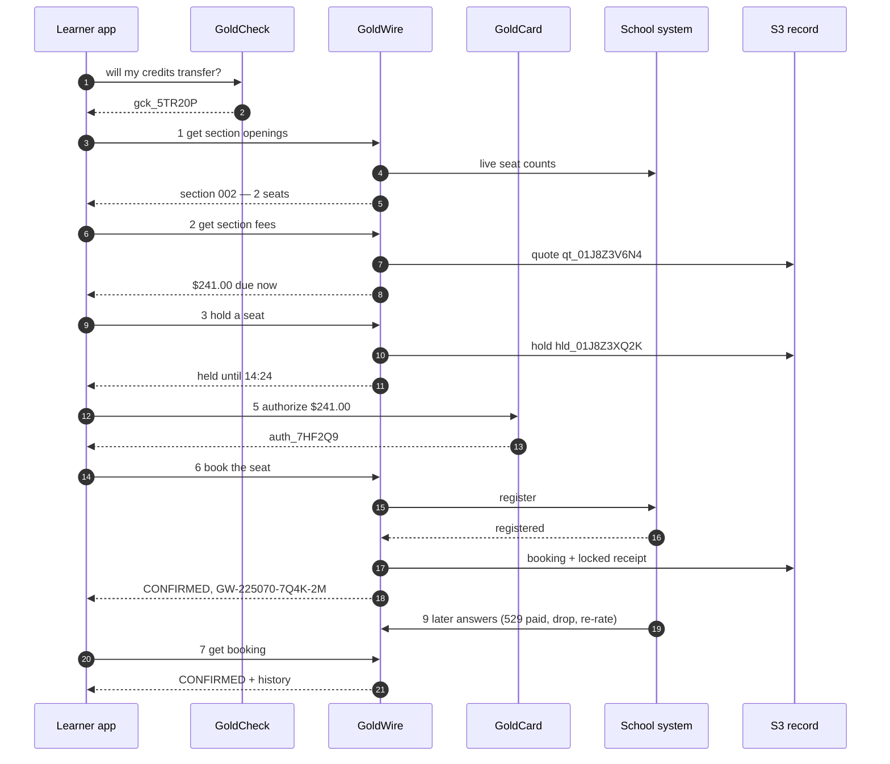

# GoldWire POC — summary

> **Draft for discussion.** Nothing here is live. One page per call follows this summary; each page
> can be read on its own.

## What GoldWire does

GoldWire gets a learner **from "this course counts" to "I have a seat"**. A course has sections; a
section is like a flight — a fixed number of seats, each with a price. GoldWire shows the seats, prices
one, holds it while the learner pays, books it with the school, and keeps a record of every step in S3.

There are two ways to pay for a seat:

| | **Reserve** — like OpenTable | **Prepay** — with GoldCard |
|---|---|---|
| At booking | nothing is charged; a card or account is kept only against a no-show fee the school publishes | GoldCard authorizes the full amount from a bank account, credit card, loan or 529 plan |
| Tuition is paid | to the school, on its bill, by its due date | by GoldCard, taken when the school confirms |

Four services, each with one job:

| Service | Its job |
|---|---|
| **GoldCheck** | what the school's own record says the course counts toward |
| **GoldWire** | sections, seats, prices, holds and bookings |
| **GoldCard** | the money: authorize, guarantee, capture, refund |
| **S3** | the permanent record of every quote, hold and booking |

**The school decides.** A held seat is not a registration. A booking is `CONFIRMED` only when the
school's own registration system says the learner is registered.

---

## The calls

| # | Call | Method and path | In one line | Page |
|---|---|---|---|---|
| 1 | Get section openings | `GET /goldwire/v1/sections` | which sections of a course have seats this term | [01](01-get-section-openings.md) |
| 2 | Get section fees | `GET /goldwire/v1/sections/{section_id}/fees` | what one seat costs, due now vs. due at the school; returns a 30-minute quote | [02](02-get-section-fees.md) |
| 3 | Hold a seat | `PUT /goldwire/v1/holds/{idempotency_key}` | keep one seat for 20 minutes at the quoted price — or join the waitlist | [03](03-hold-seat.md) |
| 4 | Get a hold | `GET /goldwire/v1/holds/{hold_id}` | is my seat still held, and for how long | [04](04-get-hold.md) |
| 5 | GoldCard authorize | `PUT /goldcard/v1/authorizations/{idempotency_key}` | arrange the money (prepay) or the guarantee (reserve) | [05](05-goldcard-authorize.md) |
| 6 | Book the seat | `PUT /goldwire/v1/bookings/{idempotency_key}` | send the registration to the school and return its answer | [06](06-book-seat.md) |
| 7 | Get a booking | `GET /goldwire/v1/bookings/{booking_id}` | am I in? — the booking and its full history | [07](07-get-booking.md) |
| 8 | Release a seat | `PUT /goldwire/v1/releases/{idempotency_key}` | let go of a hold, leave a waitlist, or drop — with the refund the policy gives | [08](08-release-seat.md) |
| 9 | Record the school's answer | `PUT /goldwire/v1/bookings/{booking_id}/school-answer` | *(internal)* the school's later answer lands on the booking | [09](09-record-school-answer.md) |

---

## One learner, start to finish

Every page uses this same example. Learner `lrn_8f3a2c91d7` wants **ENGL 1301 Composition I** at
school `225070`, **Spring 2027**, and pays by credit card.

| Time | Call | Sends | Gets back |
|---|---|---|---|
| 14:02 | **GoldCheck** | courses held, school `225070` | `gck_5TR20P` — counts toward English Composition, AA General Studies |
| 14:02 | **1 Get section openings** | `unitid 225070`, `lu_225070_ENGL1301`, `2027SP` | section **002**, Tue/Thu 9:30, **2 seats left** → `sec_225070_2027SP_ENGL1301_002` |
| 14:03 | **2 Get section fees** | that section, `prepay`, `in_district` | **$241.00 due now** (tuition $186, fees $55) → quote `qt_01J8Z3V6N4`, good until 14:33 |
| 14:04 | **3 Hold a seat** | the section and the quote | seat held until **14:24** → `hld_01J8Z3XQ2K` |
| 14:06 | **5 GoldCard authorize** | the hold, $241.00, Visa token | authorized, not yet charged → `auth_7HF2Q9` |
| 14:09 | **4 Get a hold** | the hold | `HELD`, 900 seconds left |
| 14:11 | **6 Book the seat** | the hold, the authorization, attestations | school says **registered** → `bkg_01J8Z42M7R`, confirmation **GW-225070-7Q4K-2M**; card charged $241.00 |
| any time | **7 Get a booking** | the booking | `CONFIRMED`, with history |
| 20 Jan 2027 | **8 Release a seat** | the booking, reason `schedule_conflict` | `DROPPED`; before 2 Feb, so **100% refund, $241.00** |

With a **529 plan** instead of a card, step 6 comes back `SUBMITTED` ("Awaiting 529 plan payment"), and
**Call 9** turns it into `CONFIRMED` on 9 October when the plan pays.

---

## Rules every call follows

- **Sign-in.** Every learner call carries the learner's token; it must match the `learner_id` sent.
- **Private ids.** Learners are `lrn_…` ids — never a name, email or SSN. A school student ID is sent only to that school and never returned.
- **Money** is always written `{ "amount": "241.00", "currency": "USD" }` — text with two decimals, never a floating-point number.
- **Safe retries.** Every call that changes something is a `PUT` to a key the client makes up. Sending it again returns the first answer — **never a second seat, booking or charge.**
- **Every reply** starts with `contract` (`goldwire_v1`), `request_id` (tracking number), `status`, `as_of` (when the numbers were read) and, where the numbers came from the school, `source`.
- **`not_held` is an answer**, not an error: GoldSeam hasn't captured that school record yet. It is never filled in with a guess.
- **A school's "no" is an answer**, not an error: `booking_state: REJECTED` with the school's reason in its own words.
- **Nothing is invented.** No fee, seat count or refund appears unless the school published it.
- **Someone else's records look like missing records** — the reply never reveals they exist.

---

## States

**A hold**

| State | Means |
|---|---|
| `HELD` | the seat is the learner's until the hold expires (20 minutes) |
| `WAITLISTED` | on the waitlist, no seat yet |
| `OFFERED` | a waitlist place became a seat, kept 24 hours |
| `SECTION_FULL` | *(reply only)* no seat, no waitlist place; nothing held |
| `BOOKED` | turned into a booking |
| `EXPIRED` | time ran out; the seat went back |
| `RELEASED` | the learner let it go |

**A booking**

| State | Means |
|---|---|
| `SUBMITTED` | sent to the school; waiting on its answer |
| `CONFIRMED` | the school registered the learner |
| `WAITLISTED` | the school waitlisted the learner instead |
| `REJECTED` | the school said no, with its reason |
| `DROP_REQUESTED` | a drop was sent; waiting on the school |
| `DROPPED` | the school dropped the registration |

## Things that happen on their own

| What | When | Effect |
|---|---|---|
| Hold expiry | every minute | holds past 20 minutes become `EXPIRED`; seat and any authorization released |
| Waitlist offer | when a seat opens | the first waitlisted learner's hold becomes `OFFERED` for 24 hours; they're notified |
| Resend to the school | every 5 minutes, for 24 hours | bookings and drops the school didn't answer are sent again; after 24 hours an unanswered booking is `REJECTED` |
| Seat recount | every 15 minutes | seat counts are checked against the school's; active holds are never removed |

---

## Every error code

The exact messages, with real values, are on each call's page.

| Code | HTTP | Means | Calls |
|---|---|---|---|
| `VALIDATION_FAILED` | 400 | a field is missing or in the wrong form | all |
| `UNAUTHENTICATED` | 401 | no valid sign-in token | all |
| `LEARNER_MISMATCH` | 403 | token is for another learner | 1–8 |
| `SCOPE_MISMATCH` | 403 | school adapter used for the wrong school | 9 |
| `SCHOOL_NOT_FOUND` | 404 | no such UNITID | 1 |
| `COURSE_NOT_FOUND` | 404 | no such course | 1 |
| `SECTION_NOT_FOUND` | 404 | no such section | 2, 3 |
| `QUOTE_NOT_FOUND` | 404 | no such quote for this learner | 3 |
| `HOLD_NOT_FOUND` | 404 | no such hold for this learner | 4, 5, 6, 8 |
| `BOOKING_NOT_FOUND` | 404 | no such booking for this learner | 7, 8, 9 |
| `GOLDCHECK_REF_NOT_FOUND` | 404 | no such GoldCheck answer | 1, 3 |
| `FUNDING_SOURCE_NOT_FOUND` | 404 | card/account/plan not saved in GoldCard | 5 |
| `AUTHORIZATION_NOT_FOUND` | 404 | no such GoldCard authorization | 6 |
| `GUARANTEE_NOT_FOUND` | 404 | no such GoldCard guarantee | 6 |
| `PAYMENT_DECLINED` | 402 | the card, bank, plan or lender said no | 5 |
| `SECTION_CANCELLED` | 409 | the school cancelled the section | 2, 3 |
| `SECTION_NOT_BOOKABLE` | 409 | registration not open, closed, restricted, or school not connected | 2, 3 |
| `PRICE_CHANGED` | 409 | the school changed its fees after the quote | 3 |
| `ACTIVE_HOLD_EXISTS` | 409 | already holding a seat in this course this term | 3 |
| `ALREADY_BOOKED` | 409 | already booked in this course this term | 3 |
| `HOLD_LIMIT_REACHED` | 409 | 5 active holds already | 3 |
| `HOLD_NOT_ACTIVE` | 409 | the hold is waitlisted or released | 5, 6 |
| `HOLD_ALREADY_BOOKED` | 409 | the hold was booked already | 6, 8 |
| `ALREADY_RELEASED` | 409 | already released, expired or dropped | 8 |
| `DROP_DEADLINE_PASSED` | 409 | past the school's last drop date | 8 |
| `INVALID_TRANSITION` | 409 | the school's answer doesn't fit the booking's state | 9 |
| `QUOTE_EXPIRED` | 410 | more than 30 minutes since the quote | 3 |
| `HOLD_EXPIRED` | 410 | more than 20 minutes since the hold | 5, 6 |
| `AUTHORIZATION_EXPIRED` | 410 | the GoldCard authorization ran out | 6 |
| `VERSION_CONFLICT` | 412 | the booking changed before this answer landed | 9 |
| `COURSE_NOT_AT_SCHOOL` | 422 | the course belongs to another school | 1 |
| `FUNDING_SOURCE_NOT_ACCEPTED` | 422 | the school doesn't take that kind of money through GoldCard | 2, 5 |
| `QUOTE_SECTION_MISMATCH` | 422 | quote is for another section | 3 |
| `QUOTE_HOLD_MISMATCH` | 422 | quote is not the hold's quote | 5 |
| `QUOTE_HAS_NO_PRICE` | 422 | the quote request had no residency | 3 |
| `PAYMENT_MODE_MISMATCH` | 422 | reserve vs prepay doesn't match | 3, 5, 6 |
| `AMOUNT_MISMATCH` | 422 | amount isn't the amount due now | 5 |
| `PAYMENT_MISMATCH` | 422 | the authorization is for another hold or amount | 6 |
| `ATTESTATION_REQUIRED` | 422 | prerequisites must be confirmed | 6 |
| `POLICY_NOT_ACKNOWLEDGED` | 422 | the refund policy must be acknowledged | 6 |
| `STUDENT_REF_REQUIRED` | 422 | the school needs the learner's student ID there | 6 |
| `IDEMPOTENCY_CONFLICT` | 422 | the retry key was already used for something else | 3, 5, 6, 8 |
| `RATE_LIMITED` | 429 | too many calls | 1–8 |
| `INTERNAL_ERROR` | 500 | a fault inside GoldWire; nothing was changed | all |
| `SCHOOL_OFFLINE` | 503 | the school's system didn't answer | 1, 2, 3 |
| `SEAT_STORE_UNAVAILABLE` | 503 | seats couldn't be counted; nothing held | 3 |
| `PAYMENT_PROVIDER_OFFLINE` | 503 | the card network, bank or GoldCard didn't answer | 5, 6 |

---

## What S3 holds

Bucket `goldwire-ledger-{env}`: every change is a new version; nothing is edited or deleted;
receipts are locked; everything is encrypted; nothing is public.

| File | Written by | Changes |
|---|---|---|
| `goldwire/{unitid}/{term}/{section_id}/quotes/{quote_id}.json` | Call 2 | never |
| `goldwire/{unitid}/{term}/{section_id}/holds/{hold_id}.json` | Call 3 | new version for `BOOKED`, `EXPIRED`, `RELEASED`, `OFFERED` |
| `goldwire/{unitid}/{term}/{section_id}/bookings/{booking_id}.json` | Call 6 | new version for each school answer, drop or price change (Calls 6, 8, 9) |
| `goldwire/receipts/{learner_id}/{booking_id}.json` | Call 6 or 9, on `CONFIRMED` | never — locked |
| `goldwire/idempotency/{key}.json` | Calls 3, 6, 8 | never; kept 24 hours |

Live seat counts are kept in a separate store that can count down safely without overselling
(e.g. DynamoDB). S3 is the record that proves each step.

---

## Open questions

1. **Privacy.** GoldSeam today stores nothing a person types. Bookings change that: how long records are kept, who can read receipts, and the privacy statement must be decided first.
2. **What "S3" means.** These pages read S3 as Amazon's storage used as the permanent record. If S3 means the school's Student Information System, Calls 6 and 9 change.
3. **Hold length.** 20 minutes suits a card. Is it right for every school and every kind of money?
4. **Reserve guarantee.** Keep a card on file only when the school publishes a no-show fee, or always?
5. **GoldWire's own fee.** Shown as $0.00 throughout.
6. **Which schools can connect.** Which registration systems give live seats and take bookings; the rest are `bookable: false`.

## Related drafts

- [goldwire-booking.md](../goldwire-booking.md) — the first design note: why the flow is shaped this way.
- [goldwire-openapi.yaml](../goldwire-openapi.yaml) — an early machine-readable form. **These pages win** where it differs; it will be regenerated from them once they are agreed.
