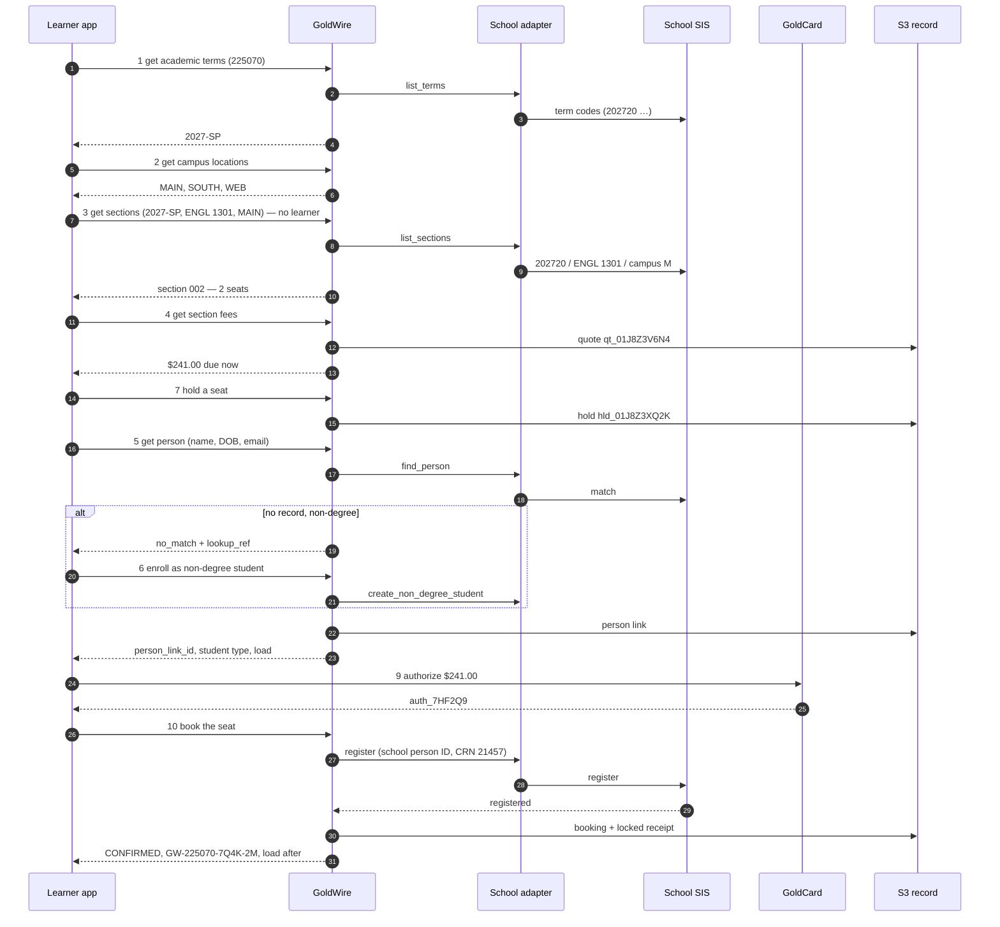

# GoldWire POC — summary

> **Draft for discussion.** Nothing here is live. The [API reference](api-reference.md) lists every
> call's arguments and response schema in tables. Two reference pages and one page per call follow;
> each page can be read on its own.

## What GoldWire does

GoldWire gets a learner **from "this course counts" to "I have a seat"**. A course has sections; a
section is like a flight — a fixed number of seats, each with a price. GoldWire shows the terms,
campuses and sections, prices a seat, finds the learner in the school's records (or enrolls them as a
non-degree student), holds the seat while they pay, books it with the school, and keeps a record of
every step in S3.

It works the same way whatever system the school runs — Banner, PeopleSoft, Colleague, Workday or a
homegrown SIS — because GoldWire speaks **one set of terms** and a per-school adapter translates.

### Kinds of student

| | **Degree-seeking** | **Non-degree** |
|---|---|---|
| Who | working toward a degree or certificate | taking courses without a program — interest, job skills, a visiting student |
| How they become a student | **apply for admission** to the school (outside GoldWire) | **enroll with GoldWire** ([Call 6](06-enroll-non-degree.md)) — no application |
| Load | full-time or part-time, by credits each term | full-time or part-time, by credits each term |

Full-time and part-time are the **load in a term**, not a kind of student. [Get person](05-get-person.md)
reports it before booking and [Book the seat](10-book-seat.md) reports it after.

### Two ways to pay for a seat

| | **Reserve** — like OpenTable | **Prepay** — with GoldCard |
|---|---|---|
| At booking | nothing is charged; a card or account is kept only against a no-show fee the school publishes | GoldCard authorizes the full amount from a bank account, credit card, loan or 529 plan |
| Tuition is paid | to the school, on its bill, by its due date | by GoldCard, taken when the school confirms |

### Four services

| Service | Its job |
|---|---|
| **GoldCheck** | what the school's own record says the course counts toward |
| **GoldWire** | terms, campuses, sections, seats, prices, person lookup, non-degree enrollment, holds and bookings |
| **GoldCard** | the money: authorize, guarantee, capture, refund |
| **S3** | the permanent record of every quote, person link, hold and booking |

**The school decides.** A held seat is not a registration. A booking is `CONFIRMED` only when the
school's own registration system says the learner is registered.

---

## Start here

| Page | What it answers |
|---|---|
| **[API reference](api-reference.md)** | **every call in one table, then each call's arguments and response schema, field by field** |
| [GoldWire terms and formats](00-terms-and-formats.md) | what every term means and exactly how it is written — `unitid 225070`, `campus_id MAIN`, `term_id 2027-SP`, `course_id ART 101`, `days TUE,THU`, `student_type non_degree` — with accepted and rejected examples |
| [How GoldWire talks to any SIS](00-sis-adapter.md) | the nine operations every school adapter provides, the three ways to connect, the crosswalk to Banner, PeopleSoft, Colleague and Workday, and one school's mapping file |

---

## The calls

| # | Call | Method and path | Who | In one line |
|---|---|---|---|---|
| [1](01-get-academic-terms.md) | Get academic terms | `GET /goldwire/v1/schools/{unitid}/terms` | app | the school's terms by year and term, with dates and registration windows |
| [2](02-get-campus-locations.md) | Get campus locations | `GET /goldwire/v1/schools/{unitid}/campuses` | app | the school's campuses, with codes, addresses and buildings |
| [3](03-get-sections.md) | Get sections | `GET /goldwire/v1/schools/{unitid}/sections` | app | every section of one course in one term, with live seats — **no learner** |
| [4](04-get-section-fees.md) | Get section fees | `GET /goldwire/v1/sections/{section_id}/fees` | learner | what one seat costs, due now vs. due at the school; a 30-minute quote |
| [5](05-get-person.md) | Get person | `POST /goldwire/v1/schools/{unitid}/persons/lookup` | learner | find the learner's own record at the school, with or without their student ID; their student type and load |
| [6](06-enroll-non-degree.md) | Enroll as a non-degree student | `PUT /goldwire/v1/schools/{unitid}/non-degree-students/{idempotency_key}` | learner | create a non-degree student record — no admission application |
| [7](07-hold-seat.md) | Hold a seat | `PUT /goldwire/v1/holds/{idempotency_key}` | learner | keep one seat for 20 minutes at the quoted price — or join the waitlist |
| [8](08-get-hold.md) | Get a hold | `GET /goldwire/v1/holds/{hold_id}` | learner | is my seat still held, and for how long |
| [9](09-goldcard-authorize.md) | GoldCard authorize | `PUT /goldcard/v1/authorizations/{idempotency_key}` | learner | arrange the money (prepay) or the guarantee (reserve) |
| [10](10-book-seat.md) | Book the seat | `PUT /goldwire/v1/bookings/{idempotency_key}` | learner | send the registration to the school; its answer, and the learner's load after |
| [11](11-get-booking.md) | Get a booking | `GET /goldwire/v1/bookings/{booking_id}` | learner | am I in? — the booking and its full history |
| [12](12-release-seat.md) | Release a seat | `PUT /goldwire/v1/releases/{idempotency_key}` | learner | let go of a hold, leave a waitlist, or drop — with the refund the policy gives |
| [13](13-record-school-answer.md) | Record the school's answer | `PUT /goldwire/v1/bookings/{booking_id}/school-answer` | school adapter | *(internal)* the school's later answer lands on the booking |

**Who calls:** *app* = any GoldSeam app with an API key; no learner is involved or sent. *learner* =
the app acting for a signed-in learner, with the learner's token. *school adapter* = the school's
connection only.

**Why Get person is a `POST`:** it is a lookup, but it carries a name and date of birth, and anything
in a URL ends up in server logs. So the details go in the body.

---

## One learner, start to finish

The call pages follow one example: a returning degree-seeking learner wants **ENGL 1301 Composition I**
at school `225070`, in person on Main Campus, **Spring 2027**, and pays by credit card.

| Time | Call | Sends | Gets back |
|---|---|---|---|
| 14:01 | **GoldCheck** | courses held, school `225070` | `gck_5TR20P` — counts toward English Composition, AA General Studies |
| 14:01 | **1 Get academic terms** | `225070`, `academic_year 2026-27` | Spring 2027, registration open → `2027-SP` |
| 14:01 | **2 Get campus locations** | `225070` | `MAIN`, `SOUTH`, `WEB` |
| 14:02 | **3 Get sections** | `2027-SP`, `ENGL 1301`, `in_person`, `MAIN` | section **002**, Tue/Thu 9:30, **2 seats left** → `sec_225070_2027SP_ENGL1301_002` |
| 14:03 | **4 Get section fees** | that section, `prepay`, `in_district` | **$241.00 due now** → quote `qt_01J8Z3V6N4`, good until 14:33 |
| 14:04 | **7 Hold a seat** | the section and the quote | seat held until **14:24** → `hld_01J8Z3XQ2K` |
| 14:05 | **5 Get person** | name, date of birth, email — student ID unknown; `2027-SP` | found: degree-seeking, admitted to AA General Studies, 6 credits so far (**part-time**) → `psl_3N8QK2WD7F` |
| 14:06 | **9 GoldCard authorize** | the hold, $241.00, Visa token | authorized, not yet charged → `auth_7HF2Q9` |
| 14:09 | **8 Get a hold** | the hold | `HELD`, 900 seconds left |
| 14:11 | **10 Book the seat** | the hold, the authorization, the person link, attestations | **registered** → `bkg_01J8Z42M7R`, **GW-225070-7Q4K-2M**; $241.00 charged; now 9 credits, still part-time |
| any time | **11 Get a booking** | the booking | `CONFIRMED`, with history |
| 20 Jan 2027 | **12 Release a seat** | the booking, reason `schedule_conflict` | `DROPPED`; before 2 Feb, so **100% refund, $241.00** |

**A new non-degree learner** (on the [Call 6 page](06-enroll-non-degree.md)): Get person returns
`no_match` with a `lookup_ref` → **6 Enroll as a non-degree student** → `psl_8H2J4K6L8M`, up to 12
credit hours without applying → then hold, pay and book as above.

**With a 529 plan** instead of a card, step 10 comes back `SUBMITTED` ("Awaiting 529 plan payment"),
and **Call 13** turns it into `CONFIRMED` on 9 October when the plan pays.

---

## Rules every call follows

- **Terms are GoldWire's, not the vendor's.** Every value is in the formats on [terms and formats](00-terms-and-formats.md); the school's own codes appear only under `native`, for staff.
- **Schedule calls carry no learner.** Terms, campuses and sections need only the app's API key.
- **Private ids.** Learners are `lrn_…` ids — never a name, email or SSN. The school's person ID is kept encrypted, sent only to that school, and shown to the learner only masked (`A*****913`). **SSNs are never accepted.** Names, birth dates and addresses are passed to the school and not kept.
- **GoldWire never submits an admission application.** Degree-seeking learners apply to the school; only non-degree enrollment goes through GoldWire.
- **Money** is always `{ "amount": "241.00", "currency": "USD" }` — text with two decimals.
- **Safe retries.** Every call that changes something is a `PUT` to a key the client makes up. Sending it again returns the first answer — **never a second seat, record, booking or charge.**
- **Every reply** starts with `contract` (`goldwire_v1`), `request_id`, `status`, `as_of` and, where the numbers came from the school, `source`.
- **`not_held` is an answer**, not an error: GoldSeam hasn't captured that record, or has no mapping for one of the school's codes yet. It is never filled in with a guess.
- **A school's "no" is an answer**, not an error: `REJECTED` or `refused`, with the school's reason in its own words.
- **Someone else's records look like missing records** — the reply never reveals they exist.

---

## States

**A hold:** `HELD` · `WAITLISTED` · `OFFERED` (a waitlist place became a seat, 24 hours) · `SECTION_FULL` (reply only) · `BOOKED` · `EXPIRED` · `RELEASED`.

**A booking:** `SUBMITTED` · `CONFIRMED` · `WAITLISTED` · `REJECTED` · `DROP_REQUESTED` · `DROPPED`.

**A person lookup** (`match_status`): `matched` · `multiple_possible` · `no_match` · `id_mismatch`.

**A non-degree enrollment** (`enrollment_status`): `created` · `pending_school_review` · `refused` · `already_known`.

## Things that happen on their own

| What | When | Effect |
|---|---|---|
| Calendar and campus refresh | daily | terms and campuses re-read from each school |
| Hold expiry | every minute | holds past 20 minutes become `EXPIRED`; seat and any authorization released |
| Waitlist offer | when a seat opens | the first waitlisted learner's hold becomes `OFFERED` for 24 hours; they're notified |
| Resend to the school | every 5 minutes, for 24 hours | bookings, drops and non-degree enrollments the school didn't answer are sent again |
| Seat recount | every 15 minutes | seat counts are checked against the school's; active holds are never removed |

Every error code, with its HTTP status and the calls that return it, is in the
[API reference](api-reference.md#every-error-code).

---

## What S3 holds

Bucket `goldwire-ledger-{env}`: every change is a new version; nothing is edited or deleted;
receipts are locked; everything is encrypted; nothing is public.

| File | Written by | Changes |
|---|---|---|
| `goldwire/{unitid}/{term_id}/{section_id}/quotes/{quote_id}.json` | Call 4 | never |
| `goldwire/persons/{unitid}/{learner_id}.json` | Call 5 on `matched`; Call 6 on `created` / `already_known` | a new version if the link changes |
| `goldwire/persons/{unitid}/attempts/{learner_id}/{date}.json` | Call 5 | counts and results only — no personal details |
| `goldwire/{unitid}/{term_id}/{section_id}/holds/{hold_id}.json` | Call 7 | new version for `BOOKED`, `EXPIRED`, `RELEASED`, `OFFERED` |
| `goldwire/{unitid}/{term_id}/{section_id}/bookings/{booking_id}.json` | Call 10 | new version for each school answer, drop or price change (Calls 10, 12, 13) |
| `goldwire/receipts/{learner_id}/{booking_id}.json` | Call 10 or 13, on `CONFIRMED` | never — locked |
| `goldwire/idempotency/{key}.json` | Calls 6, 7, 10, 12 | never; kept 24 hours |

Terms, campuses and sections are **not** recorded — they are read from the school. Live seat counts
are kept in a separate store that can count down safely without overselling (e.g. DynamoDB).

---

## Open questions

1. **Privacy.** GoldSeam today stores nothing a person types. Person links and bookings change that: how long records are kept, who can read receipts, and the privacy statement must be decided first.
2. **Non-degree limits.** Should GoldWire stop a non-degree learner at the school's credit cap, or only warn and let the school refuse?
3. **Dual credit.** High-school students are turned away (they need the school's dual-credit process). Is that right for the POC?
4. **What "S3" means.** These pages read S3 as Amazon's storage used as the permanent record. If S3 means the school's Student Information System, the adapter page and Calls 10 and 13 change.
5. **Hold length.** 20 minutes suits a card. Is it right for every school and every kind of money?
6. **Reserve guarantee.** Keep a card on file only when the school publishes a no-show fee, or always?
7. **GoldWire's own fee.** Shown as $0.00 throughout.
8. **Which schools can connect.** Which registration systems give live seats and take bookings; the rest list sections with `bookable: false`.

## Related drafts

- [goldwire-booking.md](../goldwire-booking.md) — the first design note: why the flow is shaped this way.
- [goldwire-openapi.yaml](../goldwire-openapi.yaml) — an early machine-readable form. **These pages win** where it differs; it will be regenerated from them once they are agreed.
