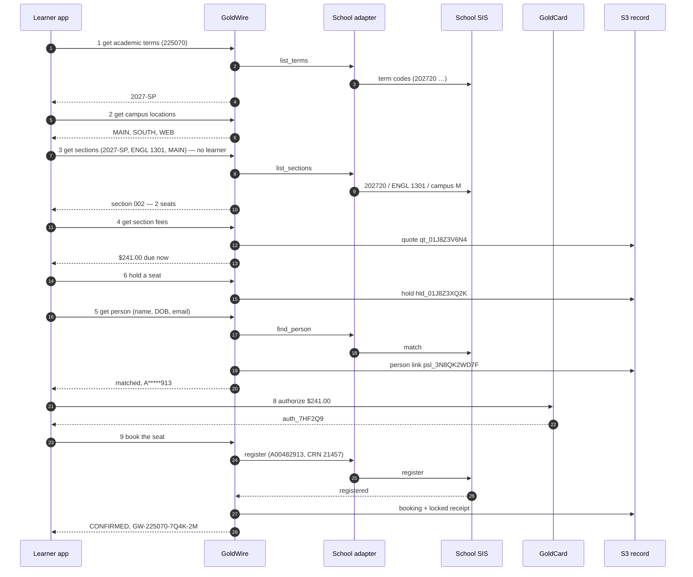

# GoldWire POC — summary

> **Draft for discussion.** Nothing here is live. Two reference pages and one page per call follow
> this summary; each page can be read on its own.

## What GoldWire does

GoldWire gets a learner **from "this course counts" to "I have a seat"**. A course has sections; a
section is like a flight — a fixed number of seats, each with a price. GoldWire shows the terms,
campuses and sections, prices a seat, finds the learner in the school's records, holds the seat while
they pay, books it with the school, and keeps a record of every step in S3.

It works the same way whatever system the school runs — Banner, PeopleSoft, Colleague, Workday or a
homegrown SIS — because GoldWire speaks **one set of terms** and a per-school adapter translates.

There are two ways to pay for a seat:

| | **Reserve** — like OpenTable | **Prepay** — with GoldCard |
|---|---|---|
| At booking | nothing is charged; a card or account is kept only against a no-show fee the school publishes | GoldCard authorizes the full amount from a bank account, credit card, loan or 529 plan |
| Tuition is paid | to the school, on its bill, by its due date | by GoldCard, taken when the school confirms |

Four services, each with one job:

| Service | Its job |
|---|---|
| **GoldCheck** | what the school's own record says the course counts toward |
| **GoldWire** | terms, campuses, sections, seats, prices, person lookup, holds and bookings |
| **GoldCard** | the money: authorize, guarantee, capture, refund |
| **S3** | the permanent record of every quote, person link, hold and booking |

**The school decides.** A held seat is not a registration. A booking is `CONFIRMED` only when the
school's own registration system says the learner is registered.

---

## Start here: the two reference pages

| Page | What it answers |
|---|---|
| [GoldWire terms and formats](00-terms-and-formats.md) | what every GoldWire term means and exactly how it is written — `unitid 225070`, `campus_id MAIN`, `term_id 2027-SP`, `course_id ART 101`, `section_number 001`, `days TUE,THU`, `time_window 17:00-22:00` — with accepted and rejected examples |
| [How GoldWire talks to any SIS](00-sis-adapter.md) | the eight operations every school adapter provides, the three ways to connect, the crosswalk from each GoldWire term to Banner, PeopleSoft, Colleague and Workday, and one school's mapping file |

---

## The calls

| # | Call | Method and path | Who | In one line | Page |
|---|---|---|---|---|---|
| 1 | Get academic terms | `GET /goldwire/v1/schools/{unitid}/terms` | app | the school's terms by year and term, with dates and registration windows | [01](01-get-academic-terms.md) |
| 2 | Get campus locations | `GET /goldwire/v1/schools/{unitid}/campuses` | app | the school's campuses, with codes, addresses and buildings | [02](02-get-campus-locations.md) |
| 3 | Get sections | `GET /goldwire/v1/schools/{unitid}/sections` | app | every section of one course in one term, with live seats — **no learner** | [03](03-get-sections.md) |
| 4 | Get section fees | `GET /goldwire/v1/sections/{section_id}/fees` | learner | what one seat costs, due now vs. due at the school; a 30-minute quote | [04](04-get-section-fees.md) |
| 5 | Get person | `POST /goldwire/v1/schools/{unitid}/persons/lookup` | learner | find the learner's own record at the school, with or without their student ID | [05](05-get-person.md) |
| 6 | Hold a seat | `PUT /goldwire/v1/holds/{idempotency_key}` | learner | keep one seat for 20 minutes at the quoted price — or join the waitlist | [06](06-hold-seat.md) |
| 7 | Get a hold | `GET /goldwire/v1/holds/{hold_id}` | learner | is my seat still held, and for how long | [07](07-get-hold.md) |
| 8 | GoldCard authorize | `PUT /goldcard/v1/authorizations/{idempotency_key}` | learner | arrange the money (prepay) or the guarantee (reserve) | [08](08-goldcard-authorize.md) |
| 9 | Book the seat | `PUT /goldwire/v1/bookings/{idempotency_key}` | learner | send the registration to the school and return its answer | [09](09-book-seat.md) |
| 10 | Get a booking | `GET /goldwire/v1/bookings/{booking_id}` | learner | am I in? — the booking and its full history | [10](10-get-booking.md) |
| 11 | Release a seat | `PUT /goldwire/v1/releases/{idempotency_key}` | learner | let go of a hold, leave a waitlist, or drop — with the refund the policy gives | [11](11-release-seat.md) |
| 12 | Record the school's answer | `PUT /goldwire/v1/bookings/{booking_id}/school-answer` | school adapter | *(internal)* the school's later answer lands on the booking | [12](12-record-school-answer.md) |

**Who calls:** *app* = any GoldSeam app with an API key; no learner is involved or sent. *learner* =
the app acting for a signed-in learner, with the learner's token. *school adapter* = the school's
connection only.

**Why Get person is a `POST`:** it is a lookup, but it carries a name and date of birth, and anything
in a URL ends up in server logs. So the details go in the body.

---

## One learner, start to finish

Every page uses this same example: a learner wants **ENGL 1301 Composition I** at school `225070`,
in person on Main Campus, **Spring 2027**, and pays by credit card.

| Time | Call | Sends | Gets back |
|---|---|---|---|
| 14:01 | **GoldCheck** | courses held, school `225070` | `gck_5TR20P` — counts toward English Composition, AA General Studies |
| 14:01 | **1 Get academic terms** | `225070`, `academic_year 2026-27` | Spring 2027, registration open → `2027-SP` |
| 14:01 | **2 Get campus locations** | `225070` | `MAIN`, `SOUTH`, `WEB` |
| 14:02 | **3 Get sections** | `2027-SP`, `ENGL 1301`, `in_person`, `MAIN` | section **002**, Tue/Thu 9:30, **2 seats left** → `sec_225070_2027SP_ENGL1301_002` |
| 14:03 | **4 Get section fees** | that section, `prepay`, `in_district` | **$241.00 due now** (tuition $186, fees $55) → quote `qt_01J8Z3V6N4`, good until 14:33 |
| 14:04 | **6 Hold a seat** | the section and the quote | seat held until **14:24** → `hld_01J8Z3XQ2K` |
| 14:05 | **5 Get person** | name, date of birth, email — student ID unknown | found, ID `A*****913`, no holds → `psl_3N8QK2WD7F` |
| 14:06 | **8 GoldCard authorize** | the hold, $241.00, Visa token | authorized, not yet charged → `auth_7HF2Q9` |
| 14:09 | **7 Get a hold** | the hold | `HELD`, 900 seconds left |
| 14:11 | **9 Book the seat** | the hold, the authorization, the person link, attestations | school says **registered** → `bkg_01J8Z42M7R`, confirmation **GW-225070-7Q4K-2M**; card charged $241.00 |
| any time | **10 Get a booking** | the booking | `CONFIRMED`, with history |
| 20 Jan 2027 | **11 Release a seat** | the booking, reason `schedule_conflict` | `DROPPED`; before 2 Feb, so **100% refund, $241.00** |

Get person (5) can run any time before booking; here it runs while the seat is held.

With a **529 plan** instead of a card, step 9 comes back `SUBMITTED` ("Awaiting 529 plan payment"), and
**Call 12** turns it into `CONFIRMED` on 9 October when the plan pays.

---

## Rules every call follows

- **Terms are GoldWire's, not the vendor's.** Every value is in the formats on [terms and formats](00-terms-and-formats.md); the school's own codes appear only under `native`, for staff.
- **Schedule calls carry no learner.** Terms, campuses and sections need only the app's API key.
- **Private ids.** Learners are `lrn_…` ids — never a name, email or SSN. The school's person ID is found by Get person, kept encrypted, sent only to that school, and shown to the learner only masked (`A*****913`). **SSNs are never accepted.**
- **Money** is always `{ "amount": "241.00", "currency": "USD" }` — text with two decimals.
- **Safe retries.** Every call that changes something is a `PUT` to a key the client makes up. Sending it again returns the first answer — **never a second seat, booking or charge.**
- **Every reply** starts with `contract` (`goldwire_v1`), `request_id` (tracking number), `status`, `as_of` (when the numbers were read) and, where the numbers came from the school, `source`.
- **`not_held` is an answer**, not an error: GoldSeam hasn't captured that school record, or has no mapping for one of the school's codes yet. It is never filled in with a guess.
- **A school's "no" is an answer**, not an error: `booking_state: REJECTED` with the school's reason in its own words.
- **Someone else's records look like missing records** — the reply never reveals they exist.

---

## States

**A hold**

| State | Means |
|---|---|
| `HELD` | the seat is the learner's until the hold expires (20 minutes) |
| `WAITLISTED` | on the waitlist, no seat yet |
| `OFFERED` | a waitlist place became a seat, kept 24 hours |
| `SECTION_FULL` | *(reply only)* no seat, no waitlist place; nothing held |
| `BOOKED` | turned into a booking |
| `EXPIRED` | time ran out; the seat went back |
| `RELEASED` | the learner let it go |

**A booking**

| State | Means |
|---|---|
| `SUBMITTED` | sent to the school; waiting on its answer |
| `CONFIRMED` | the school registered the learner |
| `WAITLISTED` | the school waitlisted the learner instead |
| `REJECTED` | the school said no, with its reason |
| `DROP_REQUESTED` | a drop was sent; waiting on the school |
| `DROPPED` | the school dropped the registration |

**A person lookup** (`match_status`): `matched` · `multiple_possible` · `no_match` · `id_mismatch`.

## Things that happen on their own

| What | When | Effect |
|---|---|---|
| Calendar and campus refresh | daily | terms and campuses re-read from each school |
| Hold expiry | every minute | holds past 20 minutes become `EXPIRED`; seat and any authorization released |
| Waitlist offer | when a seat opens | the first waitlisted learner's hold becomes `OFFERED` for 24 hours; they're notified |
| Resend to the school | every 5 minutes, for 24 hours | bookings and drops the school didn't answer are sent again; after 24 hours an unanswered booking is `REJECTED` |
| Seat recount | every 15 minutes | seat counts are checked against the school's; active holds are never removed |

---

## Every error code

The exact messages, with real values, are on each call's page.

| Code | HTTP | Means | Calls |
|---|---|---|---|
| `VALIDATION_FAILED` | 400 | a field is missing or in the wrong form | all |
| `CLIENT_UNAUTHENTICATED` | 401 | no valid app API key | 1, 2, 3 |
| `UNAUTHENTICATED` | 401 | no valid learner token (or adapter token for 12) | 4–12 |
| `LEARNER_MISMATCH` | 403 | token is for another learner | 4–11 |
| `SCOPE_MISMATCH` | 403 | school adapter used for the wrong school | 12 |
| `SCHOOL_NOT_FOUND` | 404 | no such UNITID | 1, 2, 3, 5 |
| `TERM_NOT_FOUND` | 404 | the school has no such term | 3 |
| `CAMPUS_NOT_FOUND` | 404 | the school has no such campus | 2, 3 |
| `COURSE_NOT_FOUND` | 404 | the school has no such course | 3 |
| `SECTION_NOT_FOUND` | 404 | no such section | 4, 6 |
| `QUOTE_NOT_FOUND` | 404 | no such quote for this learner | 6 |
| `PERSON_LINK_NOT_FOUND` | 404 | no such person link for this learner at this school | 9 |
| `HOLD_NOT_FOUND` | 404 | no such hold for this learner | 7, 8, 9, 11 |
| `BOOKING_NOT_FOUND` | 404 | no such booking for this learner | 10, 11, 12 |
| `GOLDCHECK_REF_NOT_FOUND` | 404 | no such GoldCheck answer | 6 |
| `FUNDING_SOURCE_NOT_FOUND` | 404 | card/account/plan not saved in GoldCard | 8 |
| `AUTHORIZATION_NOT_FOUND` | 404 | no such GoldCard authorization | 9 |
| `GUARANTEE_NOT_FOUND` | 404 | no such GoldCard guarantee | 9 |
| `PAYMENT_DECLINED` | 402 | the card, bank, plan or lender said no | 8 |
| `SECTION_CANCELLED` | 409 | the school cancelled the section | 4, 6 |
| `SECTION_NOT_BOOKABLE` | 409 | registration not open, closed, restricted, or school not connected | 4, 6 |
| `PRICE_CHANGED` | 409 | the school changed its fees after the quote | 6 |
| `ACTIVE_HOLD_EXISTS` | 409 | already holding a seat in this course this term | 6 |
| `ALREADY_BOOKED` | 409 | already booked in this course this term | 6 |
| `HOLD_LIMIT_REACHED` | 409 | 5 active holds already | 6 |
| `HOLD_NOT_ACTIVE` | 409 | the hold is waitlisted or released | 8, 9 |
| `HOLD_ALREADY_BOOKED` | 409 | the hold was booked already | 9, 11 |
| `ALREADY_RELEASED` | 409 | already released, expired or dropped | 11 |
| `DROP_DEADLINE_PASSED` | 409 | past the school's last drop date | 11 |
| `INVALID_TRANSITION` | 409 | the school's answer doesn't fit the booking's state | 12 |
| `QUOTE_EXPIRED` | 410 | more than 30 minutes since the quote | 6 |
| `HOLD_EXPIRED` | 410 | more than 20 minutes since the hold | 8, 9 |
| `AUTHORIZATION_EXPIRED` | 410 | the GoldCard authorization ran out | 9 |
| `VERSION_CONFLICT` | 412 | the booking changed before this answer landed | 12 |
| `FUNDING_SOURCE_NOT_ACCEPTED` | 422 | the school doesn't take that kind of money through GoldCard | 4, 8 |
| `QUOTE_SECTION_MISMATCH` | 422 | quote is for another section | 6 |
| `QUOTE_HOLD_MISMATCH` | 422 | quote is not the hold's quote | 8 |
| `QUOTE_HAS_NO_PRICE` | 422 | the quote request had no residency | 6 |
| `PAYMENT_MODE_MISMATCH` | 422 | reserve vs prepay doesn't match | 6, 8, 9 |
| `AMOUNT_MISMATCH` | 422 | amount isn't the amount due now | 8 |
| `PAYMENT_MISMATCH` | 422 | the authorization is for another hold or amount | 9 |
| `ATTESTATION_REQUIRED` | 422 | prerequisites must be confirmed | 9 |
| `POLICY_NOT_ACKNOWLEDGED` | 422 | the refund policy must be acknowledged | 9 |
| `IDEMPOTENCY_CONFLICT` | 422 | the retry key was already used for something else | 6, 8, 9, 11 |
| `LOOKUP_LIMIT_REACHED` | 429 | 5 person lookups at this school in 24 hours | 5 |
| `RATE_LIMITED` | 429 | too many calls | 1–11 |
| `INTERNAL_ERROR` | 500 | a fault inside GoldWire; nothing was changed | all |
| `SCHOOL_OFFLINE` | 503 | the school's system didn't answer | 3, 4, 5, 6 |
| `SEAT_STORE_UNAVAILABLE` | 503 | seats couldn't be counted; nothing held | 6 |
| `PAYMENT_PROVIDER_OFFLINE` | 503 | the card network, bank or GoldCard didn't answer | 8, 9 |

---

## What S3 holds

Bucket `goldwire-ledger-{env}`: every change is a new version; nothing is edited or deleted;
receipts are locked; everything is encrypted; nothing is public.

| File | Written by | Changes |
|---|---|---|
| `goldwire/{unitid}/{term_id}/{section_id}/quotes/{quote_id}.json` | Call 4 | never |
| `goldwire/persons/{unitid}/{learner_id}.json` | Call 5, on `matched` | a new version if a later lookup matches a different record |
| `goldwire/persons/{unitid}/attempts/{learner_id}/{date}.json` | Call 5 | counts and results only — no personal details |
| `goldwire/{unitid}/{term_id}/{section_id}/holds/{hold_id}.json` | Call 6 | new version for `BOOKED`, `EXPIRED`, `RELEASED`, `OFFERED` |
| `goldwire/{unitid}/{term_id}/{section_id}/bookings/{booking_id}.json` | Call 9 | new version for each school answer, drop or price change (Calls 9, 11, 12) |
| `goldwire/receipts/{learner_id}/{booking_id}.json` | Call 9 or 12, on `CONFIRMED` | never — locked |
| `goldwire/idempotency/{key}.json` | Calls 6, 9, 11 | never; kept 24 hours |

Terms, campuses and sections are **not** recorded — they are read from the school. Live seat counts
are kept in a separate store that can count down safely without overselling (e.g. DynamoDB).

---

## Open questions

1. **Privacy.** GoldSeam today stores nothing a person types. Person links and bookings change that: how long records are kept, who can read receipts, and the privacy statement must be decided first. Get person discards the name and contact details after matching, but the link to the school's ID is kept.
2. **New people.** When Get person finds no record, should GoldWire ever create one at the school (`new_person_allowed`), or always send the learner to apply?
3. **What "S3" means.** These pages read S3 as Amazon's storage used as the permanent record. If S3 means the school's Student Information System, the adapter page and Calls 9 and 12 change.
4. **Hold length.** 20 minutes suits a card. Is it right for every school and every kind of money?
5. **Reserve guarantee.** Keep a card on file only when the school publishes a no-show fee, or always?
6. **GoldWire's own fee.** Shown as $0.00 throughout.
7. **Which schools can connect.** Which registration systems give live seats and take bookings; the rest list sections with `bookable: false`.

## Related drafts

- [goldwire-booking.md](../goldwire-booking.md) — the first design note: why the flow is shaped this way.
- [goldwire-openapi.yaml](../goldwire-openapi.yaml) — an early machine-readable form. **These pages win** where it differs; it will be regenerated from them once they are agreed.
